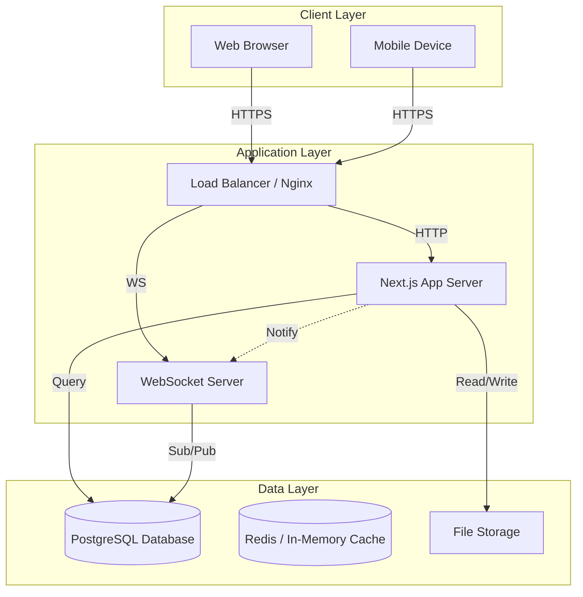
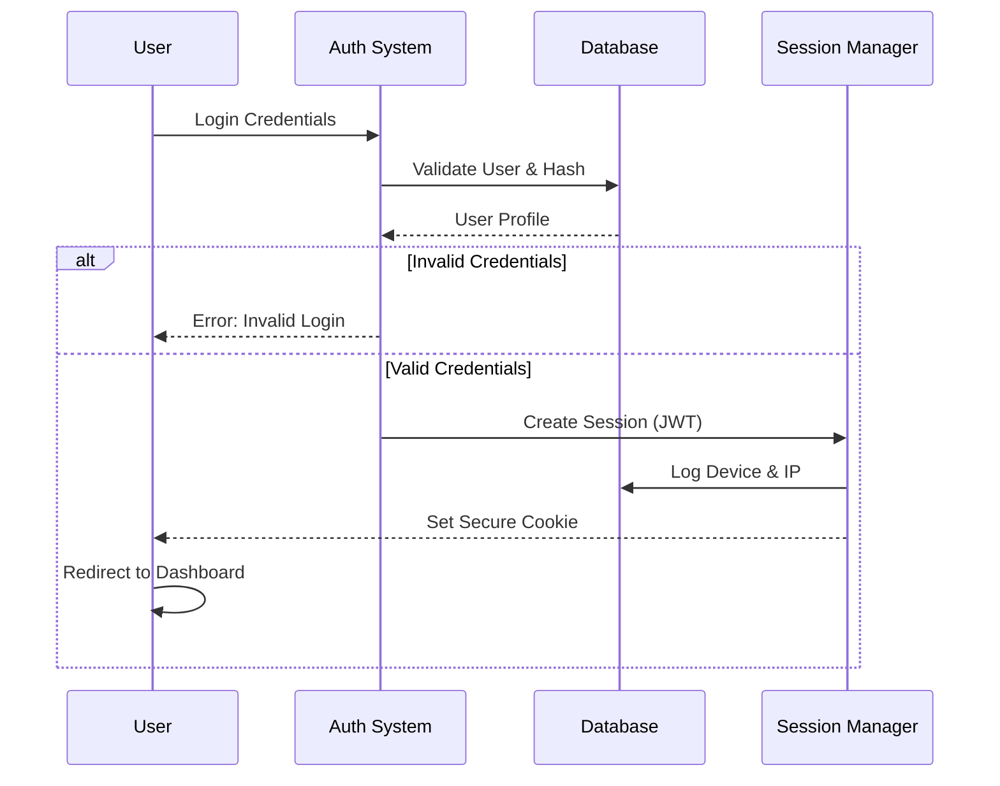
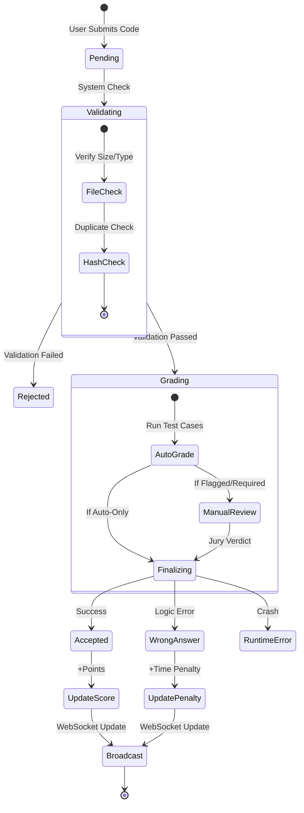
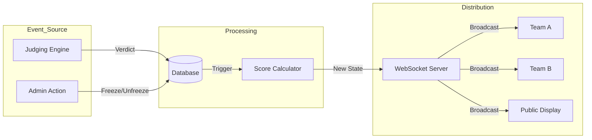

# System Architecture & Flow

This document outlines the high-level architecture and user flows of the **UOLJudge** platform. It is designed to provide developers and system administrators with a clear understanding of how data moves through the system.

## High-Level Architecture

The platform is built on a modern stack ensuring high availability, real-time synchronization, and zero-trust security.

---

## Core User Flows

### 1. Authentication & Session Management

Strict role-based access control (RBAC) ensures isolation between Admins, Jury, and Participants.

### 2. Submission & Judging Pipeline

The core loop of the contest: Submission -> Validation -> Judging -> Scoring.

### 3. Real-Time Leaderboard Updates

How the leaderboard stays consistent across hundreds of connected clients.

## Database Schema Overview

The database is normalized to 3NF but includes specific denormalized fields (like `TeamScore`) for performance optimization (O(1) reads).

- **User**: Central identity entity.
- **TeamProfile**: Contest-specific attributes for a user.
- **Submission**: Immutable record of code attempts.
- **Contest**: Configuration and state manager (Time, Freeze, Pause).
- **SystemLog**: Immutable audit trail of all critical actions.

For detailed schema, refer to `prisma/schema.prisma`.
