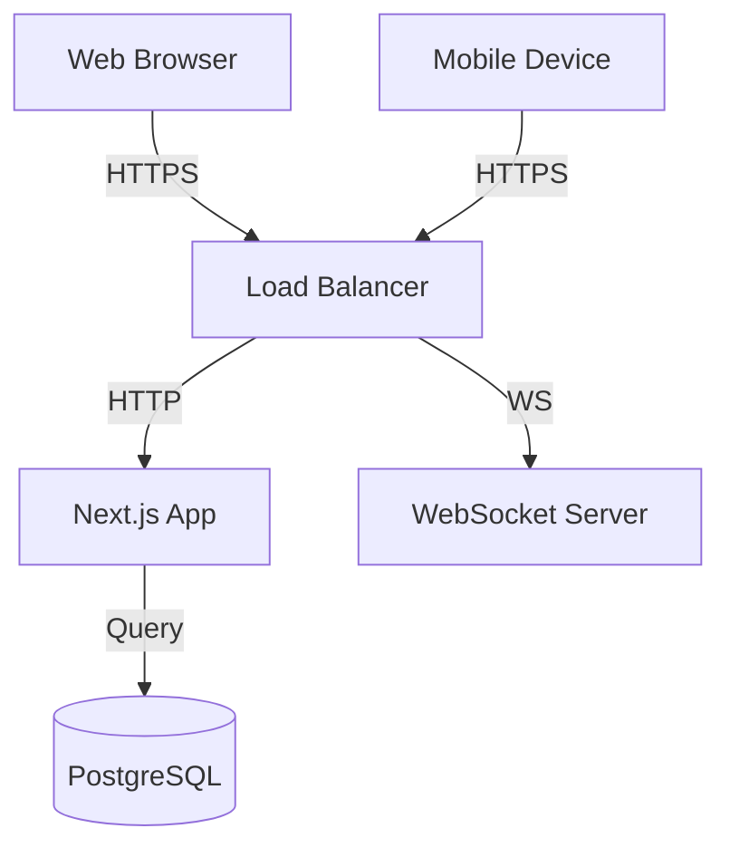

# UOLJudge


**Enterprise-Grade Programming Contest Platform**

The most reliable, feature-complete judging system for university programming contests. Built for high-availability environments where failure is not an option.

---

## 🚀 Why UOLJudge?

### vs. Codeforces / HackerRank

| Feature               | UOLJudge                 | Online Platforms     |
| --------------------- | ------------------------ | -------------------- |
| **Offline Operation** | ✅ 100% offline-capable  | ❌ Requires internet |
| **Network Latency**   | < 100ms (local)          | 200-500ms+           |
| **Data Privacy**      | ✅ Your data stays local | ❌ Cloud storage     |
| **Customization**     | ✅ Full source access    | ❌ Locked platform   |
| **Cost**              | ✅ Free, self-hosted     | 💰 Subscription fees |
| **Multi-Category**    | ✅ CORE, WEB, ANDROID    | ❌ Code only         |

### vs. DOMjudge / PC²

| Feature               | UOLJudge             | Traditional Systems    |
| --------------------- | -------------------- | ---------------------- |
| **Real-Time Updates** | ✅ WebSocket-powered | ❌ Polling/refresh     |
| **Modern UI**         | ✅ Premium shadcn/ui | ❌ Legacy interfaces   |
| **Setup Time**        | 5 minutes (Docker)   | Hours of configuration |
| **Mobile Support**    | ✅ Responsive design | ❌ Desktop only        |
| **Live Leaderboard**  | ✅ Instant updates   | ❌ Manual refresh      |

---

## ✨ Key Features

### 🎯 Zero-Trust Security

- **Role-based access control** — Admin, Jury, Participant isolation
- **Device limit enforcement** — Max 2 devices per team
- **Server-side time authority** — Clock manipulation impossible
- **Path traversal protection** — Secure file downloads

### ⚡ Real-Time Everything

- **WebSocket-powered** — < 100ms update propagation
- **Live leaderboard** — Animated score changes
- **Instant notifications** — Announcements, bans, grades
- **Presence indicators** — See who's grading what

### 🏆 ICPC-Standard Scoring

- **3-tier ranking** — Problems Solved → Score → Time Penalty
- **O(1) leaderboard reads** — Atomic accumulator pattern
- **Leaderboard freeze** — Hide final hour rankings
- **Penalty system** — 20-minute wrong answer penalties

### 📱 Multi-Category Support

- **CORE** — Traditional programming (C++, Python, Java)
- **WEB** — Frontend/fullstack projects (ZIP upload)
- **ANDROID** — Mobile apps (APK/ZIP upload)

### 🎬 Award Ceremony Generator

- **One-click export** — Interactive HTML ceremony
- **Keyboard-controlled** — Professional presentation
- **Fireworks animation** — Dramatic champion reveal
- **Offline playback** — Works without server

---

## 🏗️ Architecture

For a detailed look at the system architecture and data flow, please refer to [FLOW.md](FLOW.md).



---

## 🛠️ Quick Start

### Prerequisites

- Docker & Docker Compose
- Git

### Installation

```bash
# Clone the repository
git clone https://github.com/MuhammadAliyan10/UOLJudge.git
cd uol-judge

# Start the application using the CLI helper
./bin/uol-judge start

# Initialize database
./bin/uol-judge init
```

**Default Login:** `admin` / `uol0512`

For detailed deployment instructions, see [DEPLOYMENT.md](DEPLOYMENT.md).

---

## 🤝 Contributing

We welcome contributions! Please see [CONTRIBUTING.md](CONTRIBUTING.md) for details on how to get started.

## 🔒 Security

For security policy and reporting vulnerabilities, please refer to [SECURITY.md](SECURITY.md).

## 📄 License

This project is licensed under the MIT License - see the [LICENSE](LICENSE) file for details.

---

**UOLJudge V5.0 — When the network fails, the contest never does.**
